# Customer Segmentation of E-Commerce Data

## Introduction
In this project, we're going to divide the customers into groups that reflects similarity among customers in each group.

I've used data set which contains all the transactions occurring between 01/12/2010 and 09/12/2011 for a UK-based and registered non-store online retail.The company mainly sells unique all-occasion gifts. Many customers of the company are wholesalers.

## Dependencies
Python, Matplotlib, NumPy, Scikit-Learn, Seaborn, Plotly, Datetime, Math

## Key Data Findings

### Data Distribution
Top 5 Stockcodes:

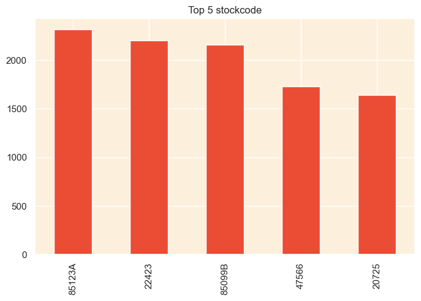

Top 5 Countries:

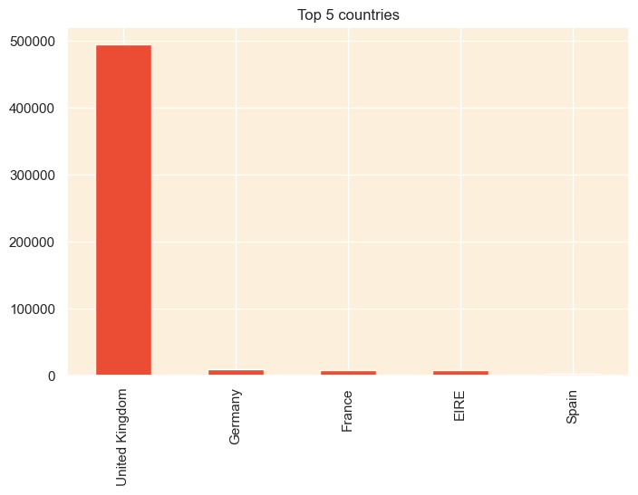

Orders per Day of the Week:

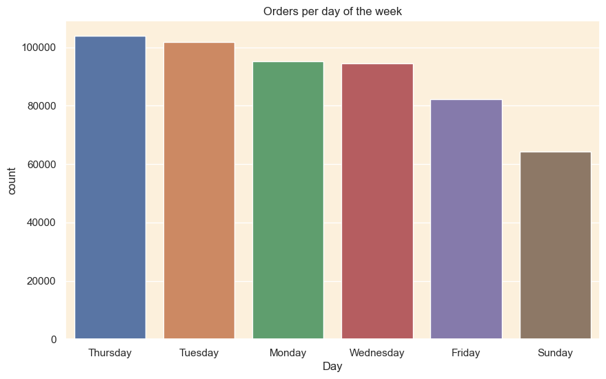

Orders per Month of the Year:

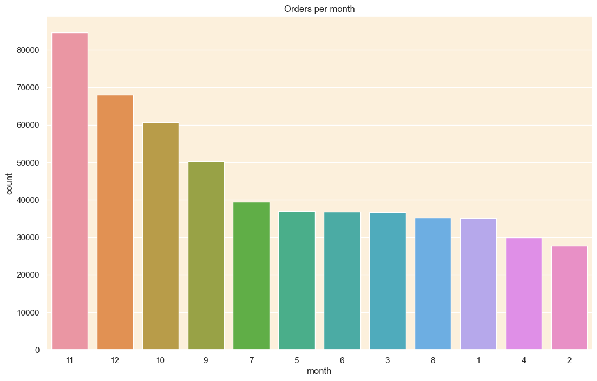

Orders Based on the Busiest Working Hours:

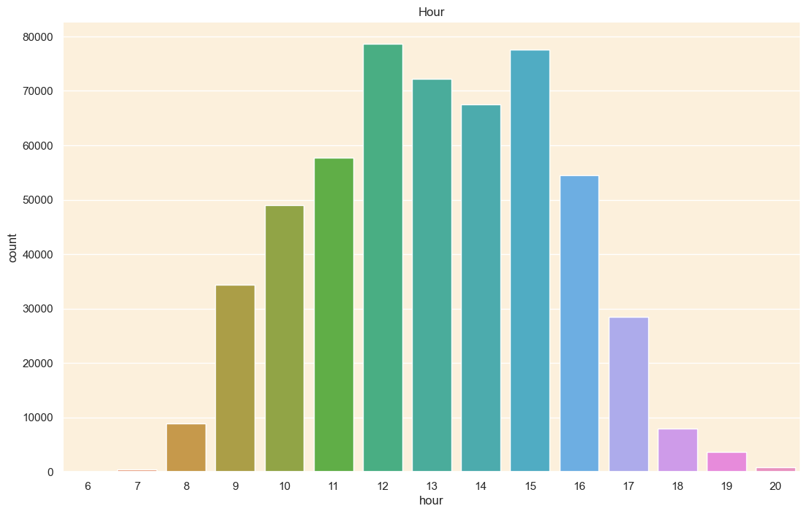

## Feature Engineering
For Feature engineering, we're going to use RFM Model.

Recency(R): This metric reflects the recency of a customer's last purchase. A lower recency value suggests that the customer has bought something more recently, signaling greater engagement with the brand.

Frequency(F): This metric measures the number of times a customer purchases within a specified period. A higher frequency value denotes more frequent interactions with the business, which may imply greater loyalty or satisfaction.

Monetary(M): This metric calculates the total spending of a customer over a specific period. A higher monetary value suggests that the customer has made more significant financial contributions to the business, reflecting their potential high lifetime value.

All features, including Recency, Frequency, and Monetary value, exhibit varying ranges, necessitating standardization. Specifically, the Monetary value feature can span a broad spectrum of values. To ensure that the inputs to our clustering algorithm are well-scaled and uniformly transformed, we will apply a logarithmic transformation to standardize these features.

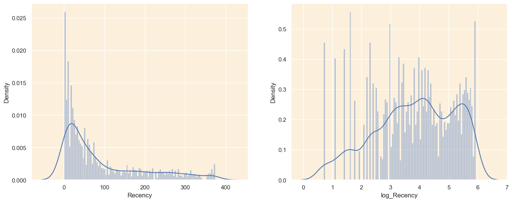

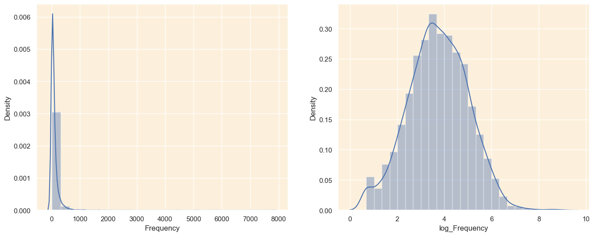

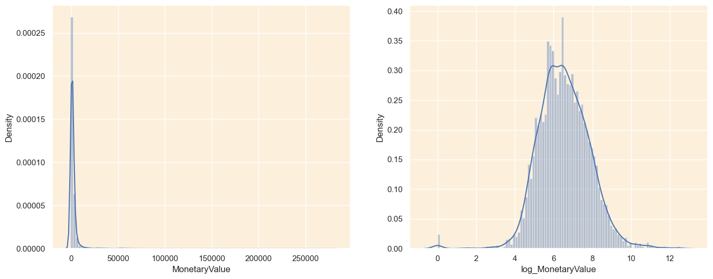

## Clustering Implementation
For implementing customer segmentation, we're going to use K-Means Clustering.

Clustering is an unsupervised learning technique used to identify groups or classes within data. We employ the K-means clustering algorithm to ascertain the optimal customer segments.

In K-means, we must specify k, the number of clusters, although initially determining the appropriate number of clusters isn't straightforward. To address this, we experiment with various numbers of clusters and assess them using their silhouette coefficients.

The silhouette score helps gauge the effectiveness of clustering algorithms like K-Means, by measuring how well each sample is grouped with other similar samples within its cluster. The silhouette coefficient, which ranges from -1 (indicating dissimilarity) to 1 (indicating similarity), is calculated for each sample across the different clusters.

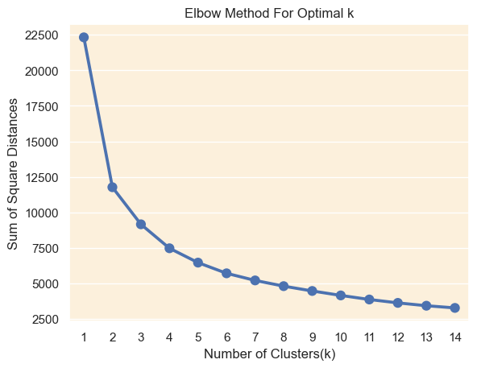

### N=2 Cluster

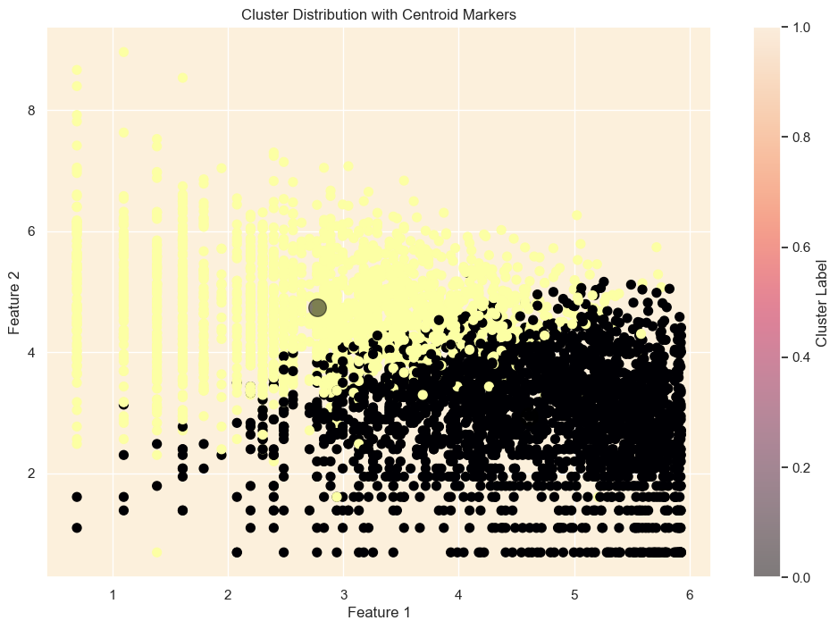

### N=4 Cluster

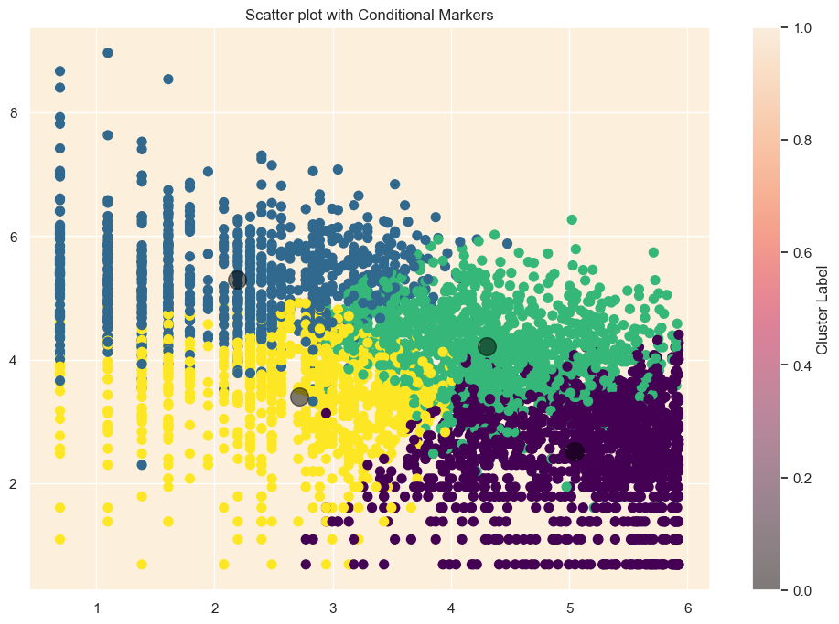
